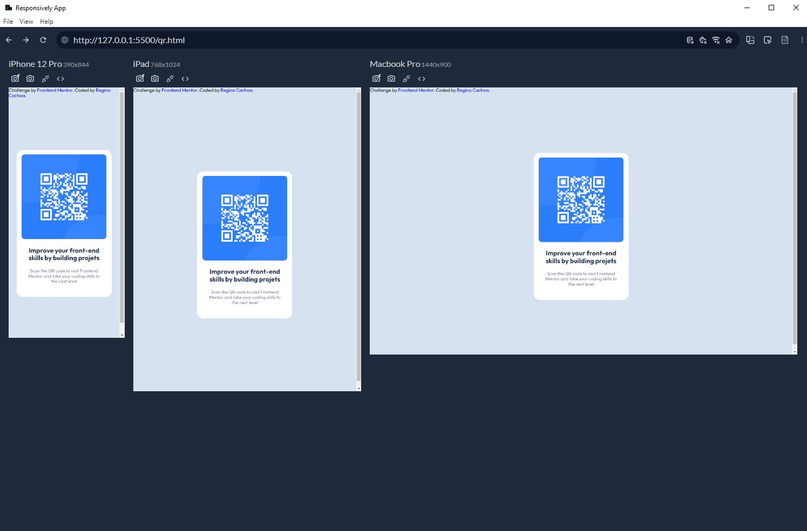

# Frontend Mentor - QR code component solution

This is a solution to the [QR code component challenge on Frontend Mentor](https://www.frontendmentor.io/challenges/qr-code-component-iux_sIO_H). Frontend Mentor challenges help you improve your coding skills by building realistic projects. 

## Table of contents

- [Overview](#overview)
- [Solution Screenshot](#solutionscreenshot)
- [My process](#my-process)
  - [Built with](#built-with)
- [Author](#author)

## Overview

First Frontend Mentor challenge, a QR code with the following design:

### SolutionScreenshot

## My process

### Built with

- Semantic HTML5 markup
- CSS custom properties
- Flexbox

## Author

- Frontend Mentor - [@reginacachoa](https://www.frontendmentor.io/profile/reginacachoa)